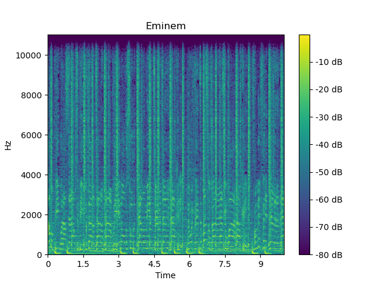

## Audio Regeneration

Tried to regenerate song using Inverse short-time Fourier transform (ISFT) and Griffin-Lim Algorithm.

# Dependencies
- python 3.9
- librosa
- matlabplot

To setup environment run the following command:

`conda env create -f environment.yml`

activate environment :

`conda activate audio-regen-env`

To run

`python main.py`

# Spectrograms 

Original song (10 seconds duration)

Just 1 iteration

500 iterations

500 iterations result is better in audio fidelity.